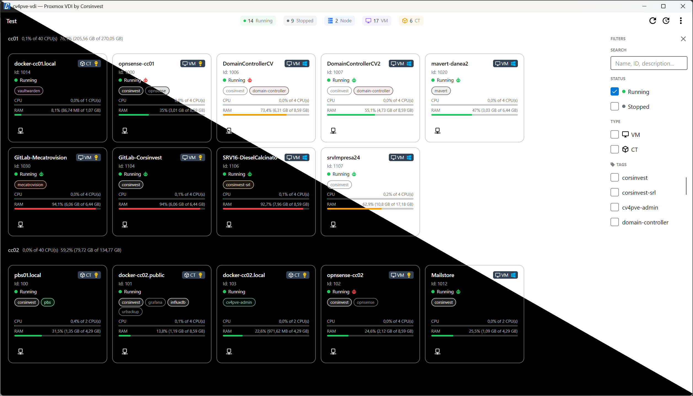
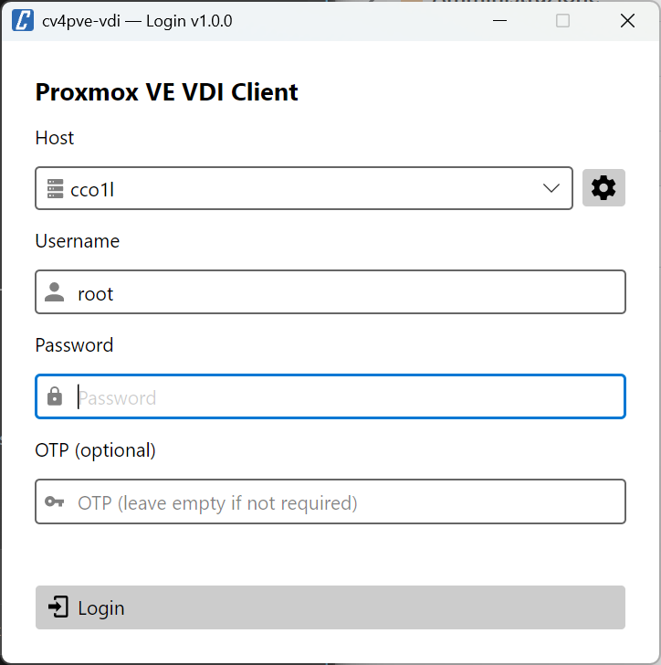
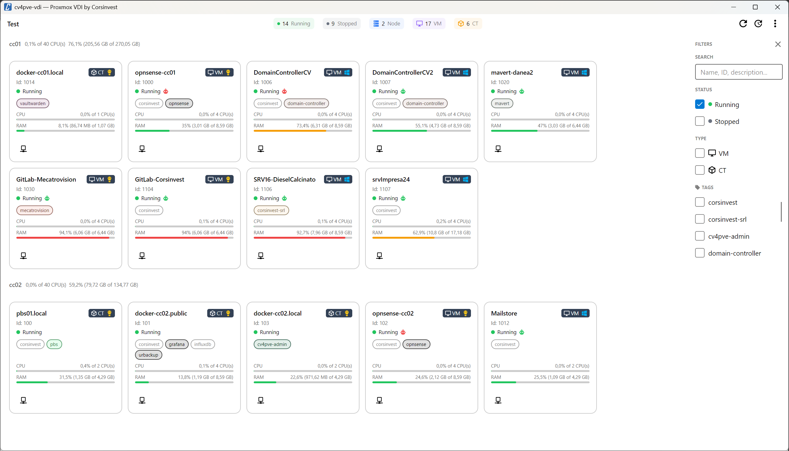
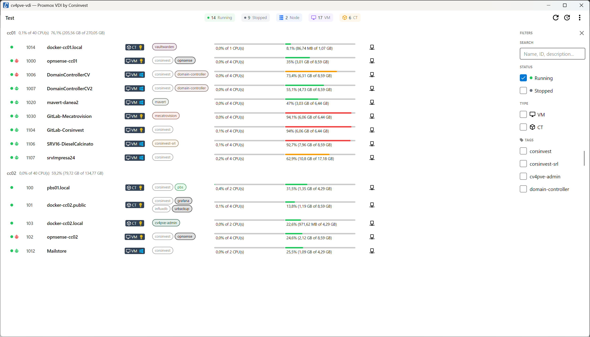
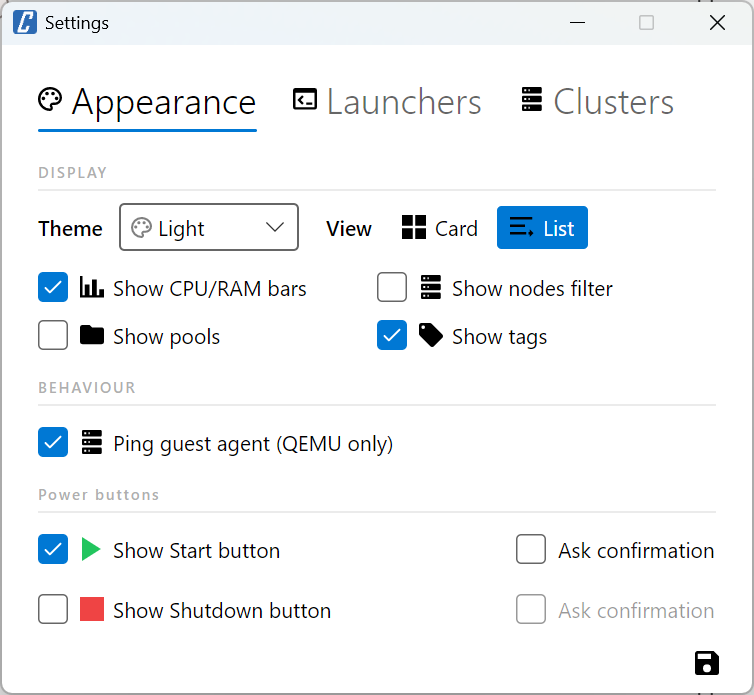
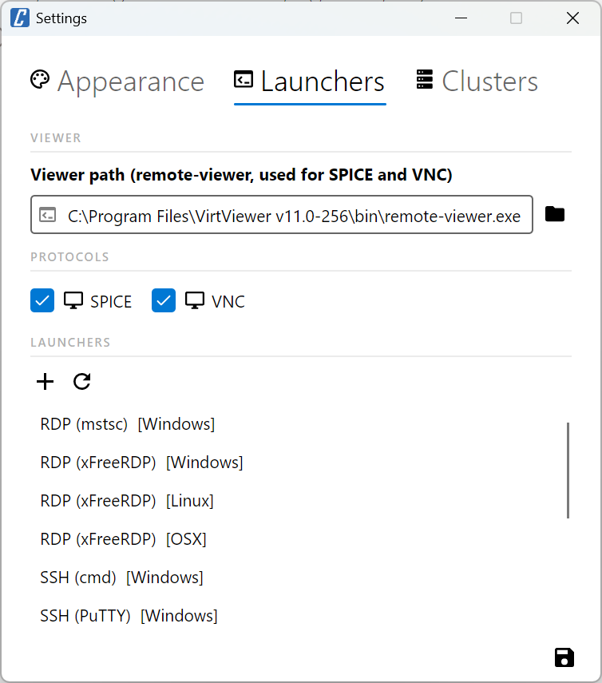
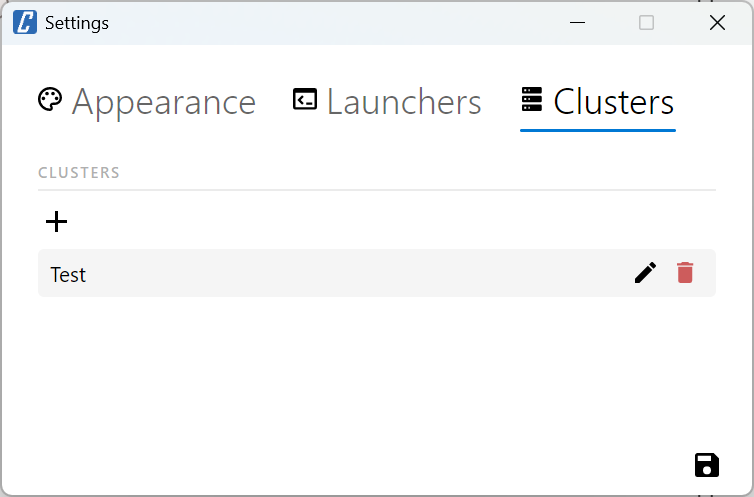
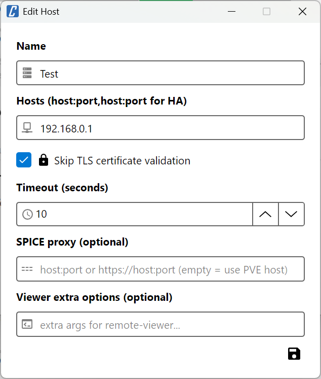
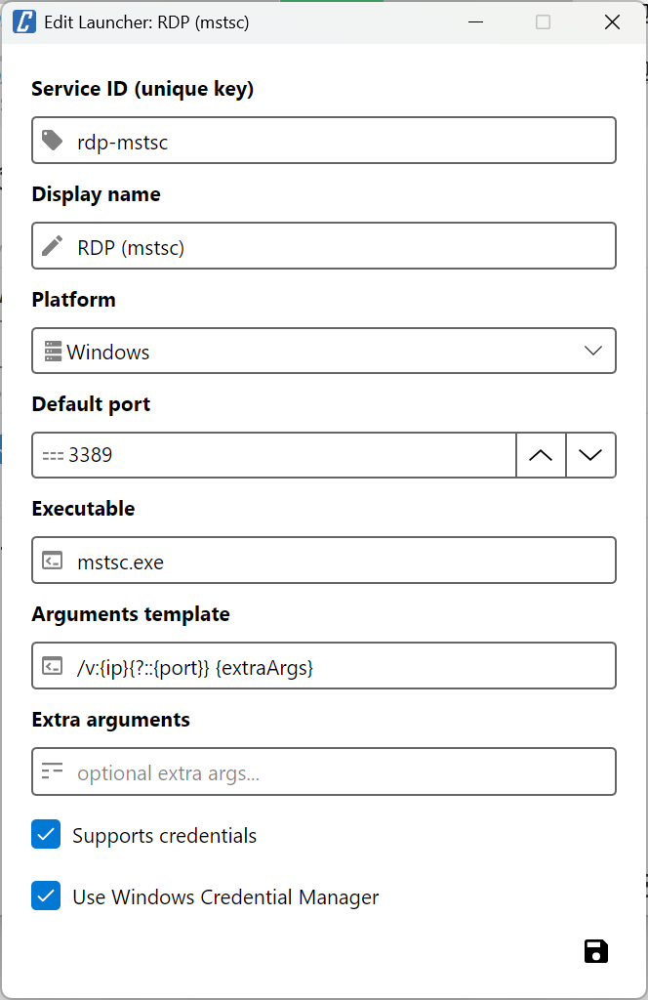

# cv4pve-vdi

```
   ______                _                      __
  / ____/___  __________(_)___ _   _____  _____/ /_
 / /   / __ \/ ___/ ___/ / __ \ | / / _ \/ ___/ __/
/ /___/ /_/ / /  (__  ) / / / / |/ /  __(__  ) /_
\____/\____/_/  /____/_/_/ /_/|___/\___/____/\__/

VDI client for Proxmox VE (Made in Italy)
```

[](LICENSE.md)
[](https://github.com/Corsinvest/cv4pve-vdi/releases/latest)
[](https://github.com/Corsinvest/cv4pve-vdi/releases)

---

## Overview

**cv4pve-vdi** is a desktop VDI client for [Proxmox VE](https://www.proxmox.com/en/proxmox-virtual-environment). It provides a graphical interface to browse, filter and connect to virtual machines and containers via **SPICE**, **VNC** and **custom service launchers** (RDP, SSH, and any other tool) — without opening the Proxmox web UI.



| Login | Card view | List view |
|-----------|-----------|-----------|
|  |  |  |

---

## Quick Start

```bash
# Check available releases at: https://github.com/Corsinvest/cv4pve-vdi/releases
# Download specific version (replace VERSION with actual version like v1.0.0)
wget https://github.com/Corsinvest/cv4pve-vdi/releases/download/VERSION/cv4pve-vdi-linux-x64.zip
unzip cv4pve-vdi-linux-x64.zip
chmod +x cv4pve-vdi
./cv4pve-vdi
```

---

## Features

### Core Capabilities

- **Card and list view** — switch between a visual card layout and a compact list
- **SPICE** console launch via `remote-viewer`
- **VNC** console via WebSocket bridge — no firewall rules or node-side configuration required (see [VNC Console](#vnc-console))
- **Custom service launchers** — RDP, SSH, PuTTY and any other tool, configurable per VM (see [Service Launchers](#service-launchers))
- **VM/CT power control** — Start and Shutdown buttons (with optional confirmation)
- **Real-time stats** — CPU and RAM usage bars per VM
- **Auto-refresh** every 30 seconds — toggle from the toolbar
- **Filter sidebar** — filter by node, pool, status, type and tags
- **Tag support** — color-coded badges with Proxmox VE tag colors
- **Multi-host** — manage multiple Proxmox VE clusters from a single client
- **Theme support** — Light and Dark themes

### VM Badges and Indicators

Each VM card and list row shows visual indicators:

| Badge | Description |
|-------|-------------|
| 🟢 **Running** dot | VM is running |
| ⚫ **Stopped** dot | VM is stopped |
| **VM / CT / Node** badge | Resource type with OS icon |
| 🟢🔴⚫ **Agent** icon | QEMU guest agent status: green = running, red = not responding, gray = ping disabled or unknown |
| 🔊 **Audio** icon | SPICE audio device configured |
| 🔌 **USB** icon | SPICE USB redirect configured |
| 📋 **Clipboard** icon | SPICE clipboard sharing configured |
| **Tag** badges | Proxmox VE tags with color |
| **CPU / RAM** bars | Real-time resource usage |

### SPICE Features (Audio, USB, Clipboard)

SPICE advanced features require the VM display to be set to **SPICE** in Proxmox VE hardware settings and **SPICE Guest Tools** installed inside the VM.

**Windows guests**: install [SPICE Guest Tools](https://www.spice-space.org/download.html) (`spice-guest-tools-*.exe`) — includes QXL display driver, WebDAV daemon (clipboard/folder sharing), audio driver and USB redirect.

**Linux guests**: install `spice-vdagent` and `spice-webdavd`.

### QEMU Guest Agent

The guest agent badge (green/red/gray) requires:

1. **Proxmox VE**: enable guest agent in VM Options → QEMU Guest Agent → **Enabled**
2. **Windows guests**: install `virtio-win` package from [virtio-win](https://github.com/virtio-win/virtio-win-pkg-scripts) or [SPICE Guest Tools](https://www.spice-space.org/download.html)
3. **Linux guests**: install `qemu-guest-agent` and start the service:
   ```bash
   apt-get install qemu-guest-agent
   systemctl enable --now qemu-guest-agent
   ```

> The agent badge is only shown on QEMU VMs (not LXC containers). Enable **Ping guest agent** in Settings → Viewer to activate live status detection. When ping is disabled the badge stays gray (unknown); once enabled, each running VM is pinged and turns green or red accordingly.

### Auto-Refresh

The toolbar has a **⟳ Auto-refresh** toggle button ("30s" label appears when active):

- Click to enable — the list refreshes automatically every **30 seconds**
- Click again to disable
- The manual **Refresh** button is always available regardless of auto-refresh state

### Smart Filtering

Only VMs and containers with actionable VDI capabilities are shown:
- **Running** VMs: visible if SPICE is active, VNC is available, or at least one service is configured
- **Stopped** VMs: visible if SPICE display (qxl/spice) is configured

### Performance

- SPICE and service checks run in parallel batches to avoid overloading the cluster
- SPICE config cached across refreshes (invalidated on VM state change)

> **Note:** Enabling **Ping guest agent** in Settings → Viewer increases refresh time, as each running VM requires an additional API call. On large clusters with many running VMs, consider disabling it if fast refresh is a priority.

---

## Service Launchers

cv4pve-vdi supports launching **any external tool** against a VM — RDP, SSH, PuTTY, and more. This is done through a two-layer system:

### Launchers (global tool definitions)

A **launcher** defines *how* to invoke an external program. Built-in launchers ship with the application (`launchers.yaml`) and cover the most common tools for each platform. You can add, edit, or remove launchers in **Settings → Launchers**.

Built-in launchers include:

| Launcher | Platform | Port |
|----------|----------|------|
| RDP (mstsc) | Windows | 3389 |
| RDP (xFreeRDP) | Windows / Linux / macOS | 3389 |
| SSH (cmd) | Windows | 22 |
| SSH (PuTTY) | Windows / Linux / macOS | 22 |
| SSH (GNOME Terminal) | Linux | 22 |
| SSH (xterm) | Linux | 22 |
| SSH (Konsole) | Linux | 22 |
| SSH (Terminal) | macOS | 22 |

Each launcher definition specifies:

- **Service ID** — unique identifier (e.g. `rdp-mstsc`, `ssh-putty-windows`)
- **Display name** — shown in the Connect menu
- **Platform** — Windows, Linux, or macOS (only launchers for the current platform are shown)
- **Default port**
- **Executable** — path to the program
- **Arguments** — command-line template with token substitution (see below)
- **Supports credentials** — whether username/password can be passed to the tool
- **Use Windows Credential Manager** — (Windows only) read credentials from the Windows Credential Manager

#### Argument tokens

The `arguments` field supports the following tokens:

| Token | Description |
|-------|-------------|
| `{ip}` | VM IP address (resolved via guest agent or from IP override) |
| `{port}` | Port number for this service |
| `{username}` | Username (from credentials) |
| `{password}` | Password (from credentials) |
| `{extraArgs}` | Extra arguments (from the service config or launcher default) |
| `{?TEXT}` | Include `TEXT` (with tokens resolved) only if all tokens inside it are non-empty |

Examples:
```
/v:{ip}{?::{port}} {extraArgs}                          # mstsc: port only if non-default
/v:{ip}{?::{port}} /cert:ignore {?/u:{username}} ...    # xfreerdp: skip /u if no username
-ssh {ip} {?-P {port}} {?-l {username}} {?-pw {password}} {extraArgs}  # PuTTY
```

### Services (per-VM configuration)

A **service** maps a launcher to a specific VM and optionally overrides port, credentials, IP, or extra arguments. Each VM can have multiple services configured (e.g. both RDP and SSH).

To configure services for a VM, click **Connect → Services...** in the VM row. From there you can:

- **Add** a new service, selecting the launcher and port
- **Edit** an existing service
- **Delete** a service
- **Discover** — scan the VM's IP for open ports and automatically suggest matching services

Once services are configured, they appear as items in the **Connect** dropdown button on the VM row.


#### Credential sources

| Source | Description |
|--------|-------------|
| **None** | No credentials passed to the launcher |
| **Manual** | Username/password stored in the configuration file |
| **Windows Credential Manager** | (Windows only) Credentials read from the Windows Credential Manager |

> [!WARNING]
> Manual credentials (username and password) are stored **in plaintext** in the configuration file:
> - Linux/macOS: `~/.config/cv4pve-vdi/config.yaml`
> - Windows: `%APPDATA%\cv4pve-vdi\config.yaml`
>
> This is consistent with other desktop tools (kubectl, git credentials, SSH config). Restrict access to the file:
> ```bash
> chmod 600 ~/.config/cv4pve-vdi/config.yaml
> ```

---

## Installation

### Permissions Required

| Permission | Purpose |
|------------|---------|
| `VM.Console` | Launch SPICE and VNC consoles |
| `VM.PowerMgmt` | Start / Shutdown VMs |
| `VM.Audit` | Read VM configuration and status |
| `VM.Monitor` | QEMU guest agent interaction (agent ping, IP detection for services) |
| `Sys.Console` | Launch node shell (SPICE) |

### VNC Console

VNC is available on all running QEMU VMs and LXC containers — **no additional configuration required** on the Proxmox VE side.

cv4pve-vdi uses the Proxmox VE API to open a **WebSocket VNC tunnel**, bridges it to a local port, and launches `remote-viewer` to display the session. This means:

- No direct network access to the VNC port on the node is needed
- No firewall rules to open on the Proxmox VE host
- The same `remote-viewer` used for SPICE is reused — no extra software required
- Works transparently through the existing Proxmox VE API connection
- Available on every running VM and CT regardless of display hardware configuration

### Linux Installation

```bash
# Check available releases and get the specific version number
# Visit: https://github.com/Corsinvest/cv4pve-vdi/releases

# Download specific version (replace VERSION with actual version like v1.0.0)
wget https://github.com/Corsinvest/cv4pve-vdi/releases/download/VERSION/cv4pve-vdi-linux-x64.zip

# Alternative: Get latest release URL programmatically
LATEST_URL=$(curl -s https://api.github.com/repos/Corsinvest/cv4pve-vdi/releases/latest | grep browser_download_url | grep linux-x64 | cut -d '"' -f 4)
wget "$LATEST_URL"

# Extract and make executable
unzip cv4pve-vdi-linux-x64.zip
chmod +x cv4pve-vdi
./cv4pve-vdi
```

### Windows Installation

**Option 1: WinGet (Recommended)**
```powershell
# Install using Windows Package Manager
winget install Corsinvest.cv4pve.vdi
```

**Option 2: Manual Installation**
```powershell
# Check available releases at: https://github.com/Corsinvest/cv4pve-vdi/releases
# Download specific version (replace VERSION with actual version)
Invoke-WebRequest -Uri "https://github.com/Corsinvest/cv4pve-vdi/releases/download/VERSION/cv4pve-vdi-win-x64.zip" -OutFile "cv4pve-vdi.zip"

# Extract
Expand-Archive cv4pve-vdi.zip -DestinationPath "C:\Tools\cv4pve-vdi"
```

### macOS Installation

```bash
# Check available releases at: https://github.com/Corsinvest/cv4pve-vdi/releases
# Download specific version (replace VERSION with actual version)

# Apple Silicon (arm64)
wget https://github.com/Corsinvest/cv4pve-vdi/releases/download/VERSION/cv4pve-vdi-osx-arm64.zip
unzip cv4pve-vdi-osx-arm64.zip

# Intel (x64)
wget https://github.com/Corsinvest/cv4pve-vdi/releases/download/VERSION/cv4pve-vdi-osx-x64.zip
unzip cv4pve-vdi-osx-x64.zip

chmod +x cv4pve-vdi
./cv4pve-vdi
```

---

## SPICE Client Setup

A SPICE viewer (`remote-viewer`) must be installed to use SPICE and VNC consoles.

<details>
<summary><strong>Linux (Debian/Ubuntu)</strong></summary>

```bash
sudo apt-get install virt-viewer
```

**Path**: `/usr/bin/remote-viewer`

</details>

<details>
<summary><strong>Linux (RHEL/Fedora)</strong></summary>

```bash
sudo dnf install virt-viewer
```

**Path**: `/usr/bin/remote-viewer`

</details>

<details>
<summary><strong>Windows</strong></summary>

Download from [SPICE Space](https://www.spice-space.org/download.html)

**Typical path**: `C:\Program Files\VirtViewer v?-???\bin\remote-viewer.exe`

</details>

<details>
<summary><strong>macOS</strong></summary>

Download from [SPICE Space macOS Client](https://www.spice-space.org/osx-client.html)

</details>

---

## Settings

| Appearance | Launchers | Clusters |
|------------|-----------|----------|
|  |  |  |

**Appearance tab**

| Setting | Description |
|---------|-------------|
| **Theme** | Light / Dark / System |
| **Show CPU/RAM bars** | Toggle resource usage bars in card and list view |
| **Show nodes filter** | Show node filter section in sidebar |
| **Show pools** | Show pool filter in sidebar and pool info in cards |
| **Show tags** | Show tag badges in cards/list and tag filter in sidebar |
| **Show Start button** | Show power-on button per VM |
| **Show Shutdown button** | Show shutdown button per VM |
| **Ask confirmation** | Confirm before Start / Shutdown |

**Viewer tab**

| Setting | Description |
|---------|-------------|
| **SPICE** | Enable SPICE console button |
| **VNC** | Enable VNC console button |
| **Ping guest agent (QEMU only)** | Ping the QEMU guest agent to show live status badge (green/red) |
| **SPICE viewer path** | Path to `remote-viewer` executable (used for both SPICE and VNC) |

**Clusters tab**

| Setting | Description |
|---------|-------------|
| **Host** | Proxmox VE API endpoint(s). Accepts a comma-separated list for HA failover: `host:port,host:port` — the first reachable host is used |
| **Skip TLS validation** | Disable certificate check (useful for self-signed certs) |
| **Timeout** | API connection timeout in seconds |
| **SPICE proxy** | Optional SPICE proxy address |
| **Viewer extra options** | Additional arguments passed to `remote-viewer` |



**Launchers tab**

Manage the list of service launchers available on this machine. Built-in launchers are loaded from `launchers.yaml` shipped with the application. You can add custom launchers, edit existing ones, or remove them. Changes are saved to your user configuration.



---

## Troubleshooting

<details>
<summary><strong>VM not visible in the list</strong></summary>

VMs are only shown if they have at least one actionable VDI capability:
- Running VM with SPICE active
- Running VM with at least one service configured
- Stopped VM with SPICE display configured (qxl or spice in hardware settings)

Check the VM's display hardware in Proxmox VE → Hardware → Display → set to **SPICE (qxl)**, or configure a service for the VM via **Connect → Services...**.

</details>

<details>
<summary><strong>SPICE launch fails</strong></summary>

- Verify the SPICE viewer path in Settings → Viewer
- Ensure `remote-viewer` is installed
- Check that the VM display is set to SPICE (qxl) in Proxmox VE hardware settings

</details>

<details>
<summary><strong>Connect button has no items</strong></summary>

The Connect dropdown shows SPICE, VNC and any configured services. If it appears empty:
- Ensure SPICE or VNC are enabled in Settings → Viewer
- Configure services for the VM via **Connect → Services...**

</details>

<details>
<summary><strong>Service not launching (RDP, SSH, etc.)</strong></summary>

- Verify the launcher executable path is correct and the tool is installed
- Ensure the VM's guest agent is active so its IP can be resolved, or set an IP override in the service configuration
- Check that the port is reachable from your machine

</details>

<details>
<summary><strong>Agent badge not showing or always gray</strong></summary>

- The agent badge is only visible on QEMU VMs (not LXC containers)
- The badge is shown if the agent is configured in Proxmox VE VM Options, but stays gray until **Ping guest agent** is enabled in Settings → Viewer
- Enable **Ping guest agent (QEMU only)** in Settings → Viewer to get live green/red status
- Ensure `qemu-guest-agent` is installed and running inside the VM

</details>

<details>
<summary><strong>SPICE audio / clipboard / USB redirect not working</strong></summary>

These features require:
1. VM display set to **SPICE** in Proxmox VE → Hardware → Display
2. **Windows**: install [SPICE Guest Tools](https://www.spice-space.org/download.html)
3. **Linux**: install `spice-vdagent` and `spice-webdavd`

The badges (audio/USB/clipboard icons) appear on the VM card only if the corresponding hardware is configured in Proxmox VE.

</details>


---

## Support

Professional support and consulting available through [Corsinvest](https://www.corsinvest.it/cv4pve).

---

If you prefer working from the terminal, check out [**cv4pve-pepper**](https://github.com/Corsinvest/cv4pve-pepper) — the command-line companion for launching SPICE consoles on Proxmox VE.

Part of [cv4pve](https://www.corsinvest.it/cv4pve) suite | Made with ❤️ in Italy by [Corsinvest](https://www.corsinvest.it)

Copyright © Corsinvest Srl
