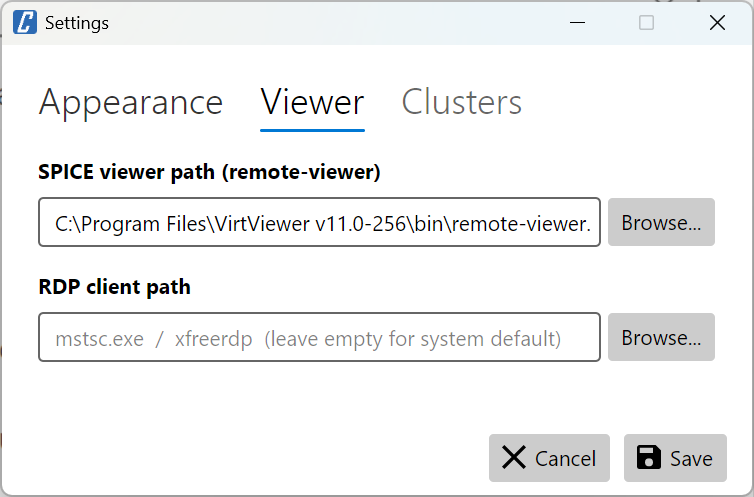

# cv4pve-vdi

```
   ______                _                      __
  / ____/___  __________(_)_   _____  _____/ /_
 / /   / __ \/ ___/ ___/ / | / / _ \/ ___/ __/
/ /___/ /_/ / /  (__  ) /| |/ /  __(__  ) /_
\____/\____/_/  /____/_/ |___/\___/____/\__/

VDI client for Proxmox VE (Made in Italy)
```

[](LICENSE.md)
[](https://github.com/Corsinvest/cv4pve-vdi/releases/latest)
[](https://github.com/Corsinvest/cv4pve-vdi/releases)

---

## Overview

**cv4pve-vdi** is a desktop VDI client for [Proxmox VE](https://www.proxmox.com/en/proxmox-virtual-environment). It provides a graphical interface to browse, filter and connect to virtual machines and containers via **SPICE** and **RDP** — without opening the Proxmox web UI.


| Login | Card view | List view |
|-----------|-----------|-----------|
|  |  |  |

---

## Quick Start

```bash
# Check available releases at: https://github.com/Corsinvest/cv4pve-vdi/releases
# Download specific version (replace VERSION with actual version like v1.0.0)
wget https://github.com/Corsinvest/cv4pve-vdi/releases/download/VERSION/cv4pve-vdi-linux-x64.zip
unzip cv4pve-vdi-linux-x64.zip
chmod +x cv4pve-vdi
./cv4pve-vdi
```

---

## Features

### Core Capabilities

- **Card and list view** — switch between a visual card layout and a compact list
- **SPICE** console launch via `remote-viewer`
- **RDP** launch via `mstsc` (Windows) or `xfreerdp` (Linux/macOS)
- **VM/CT power control** — Start and Shutdown buttons (with optional confirmation)
- **Real-time stats** — CPU and RAM usage bars per VM
- **Auto-refresh** every 10 seconds
- **Filter sidebar** — filter by node, status (running/stopped), type (VM/CT) and tags
- **Tag support** — color-coded badges with Proxmox VE tag colors
- **Multi-host** — manage multiple Proxmox VE clusters from a single client
- **Theme support** — Light and Dark themes

### Smart Filtering

Only VMs and containers with actionable VDI capabilities are shown:
- **Running** VMs: visible if SPICE is active or RDP port is open
- **Stopped** VMs: visible if SPICE display (qxl/spice) is configured

### Performance

- SPICE and RDP checks run in batches of 10 to avoid overloading the cluster
- Config-based SPICE check cached across refreshes (invalidated on state change)
- RDP cache cleared when VM stops

---

## Installation

### Permissions Required

| Permission | Purpose |
|------------|---------|
| `VM.Console` | Launch SPICE console |
| `VM.PowerMgmt` | Start / Shutdown VMs |
| `VM.Audit` | Read VM information |
| `Sys.Console` | Launch node shell (SPICE) |

### Linux Installation

```bash
# Check available releases and get the specific version number
# Visit: https://github.com/Corsinvest/cv4pve-vdi/releases

# Download specific version (replace VERSION with actual version like v1.0.0)
wget https://github.com/Corsinvest/cv4pve-vdi/releases/download/VERSION/cv4pve-vdi-linux-x64.zip

# Alternative: Get latest release URL programmatically
LATEST_URL=$(curl -s https://api.github.com/repos/Corsinvest/cv4pve-vdi/releases/latest | grep browser_download_url | grep linux-x64 | cut -d '"' -f 4)
wget "$LATEST_URL"

# Extract and make executable
unzip cv4pve-vdi-linux-x64.zip
chmod +x cv4pve-vdi
./cv4pve-vdi
```

### Windows Installation

**Option 1: WinGet (Recommended)**
```powershell
# Install using Windows Package Manager
winget install Corsinvest.cv4pve.vdi
```

**Option 2: Manual Installation**
```powershell
# Check available releases at: https://github.com/Corsinvest/cv4pve-vdi/releases
# Download specific version (replace VERSION with actual version)
Invoke-WebRequest -Uri "https://github.com/Corsinvest/cv4pve-vdi/releases/download/VERSION/cv4pve-vdi-win-x64.zip" -OutFile "cv4pve-vdi.zip"

# Extract
Expand-Archive cv4pve-vdi.zip -DestinationPath "C:\Tools\cv4pve-vdi"
```

### macOS Installation

```bash
# Check available releases at: https://github.com/Corsinvest/cv4pve-vdi/releases
# Download specific version (replace VERSION with actual version)

# Apple Silicon (arm64)
wget https://github.com/Corsinvest/cv4pve-vdi/releases/download/VERSION/cv4pve-vdi-osx-arm64.zip
unzip cv4pve-vdi-osx-arm64.zip

# Intel (x64)
wget https://github.com/Corsinvest/cv4pve-vdi/releases/download/VERSION/cv4pve-vdi-osx-x64.zip
unzip cv4pve-vdi-osx-x64.zip

chmod +x cv4pve-vdi
./cv4pve-vdi
```

---

## SPICE Client Setup

A SPICE viewer (`remote-viewer`) must be installed to use SPICE consoles.

<details>
<summary><strong>Linux (Debian/Ubuntu)</strong></summary>

```bash
sudo apt-get install virt-viewer
```

**Path**: `/usr/bin/remote-viewer`

</details>

<details>
<summary><strong>Linux (RHEL/Fedora)</strong></summary>

```bash
sudo dnf install virt-viewer
```

**Path**: `/usr/bin/remote-viewer`

</details>

<details>
<summary><strong>Windows</strong></summary>

Download from [SPICE Space](https://www.spice-space.org/download.html)

**Typical path**: `C:\Program Files\VirtViewer v?-???\bin\remote-viewer.exe`

</details>

<details>
<summary><strong>macOS</strong></summary>

Download from [SPICE Space macOS Client](https://www.spice-space.org/osx-client.html)

</details>

---

## Settings

| Appearance | Viewer | Clusters |
|------------|--------|----------|
|  |  |  |

| Setting | Description |
|---------|-------------|
| **Theme** | Light / Dark |
| **Show CPU/RAM bars** | Toggle resource usage bars |
| **Show Start button** | Show power-on button per VM |
| **Show Shutdown button** | Show shutdown button per VM |
| **Ask confirmation** | Confirm before Start / Shutdown |
| **SPICE viewer path** | Path to `remote-viewer` executable |
| **RDP client path** | Path to RDP client (`mstsc`, `xfreerdp`) — leave empty for system default |

---

## Troubleshooting

<details>
<summary><strong>VM not visible in the list</strong></summary>

VMs are only shown if they have at least one actionable VDI capability:
- Running VM with SPICE active
- Running VM with RDP port open (3389)
- Stopped VM with SPICE display configured (qxl or spice in hardware settings)

Check the VM's display hardware in Proxmox VE → Hardware → Display → set to **SPICE (qxl)**.

</details>

<details>
<summary><strong>SPICE launch fails</strong></summary>

- Verify the SPICE viewer path in Settings → Viewer
- Ensure `remote-viewer` is installed
- Check that the VM display is set to SPICE (qxl) in Proxmox VE hardware settings

</details>

<details>
<summary><strong>RDP button not appearing</strong></summary>

The RDP button appears only when:
1. The VM is running
2. The guest agent is active and reports an IP
3. Port 3389 is open on that IP

Check that `qemu-guest-agent` is installed and running inside the VM.

</details>

<details>
<summary><strong>Application appears small on HiDPI / WSL</strong></summary>

Set the scale factor manually:

```bash
AVALONIA_SCREEN_SCALE_FACTORS="0=2" ./cv4pve-vdi
```

</details>

---

## Support

Professional support and consulting available through [Corsinvest](https://www.corsinvest.it/cv4pve).

---

Part of [cv4pve](https://www.corsinvest.it/cv4pve) suite | Made with ❤️ in Italy by [Corsinvest](https://www.corsinvest.it)

Copyright © Corsinvest Srl
