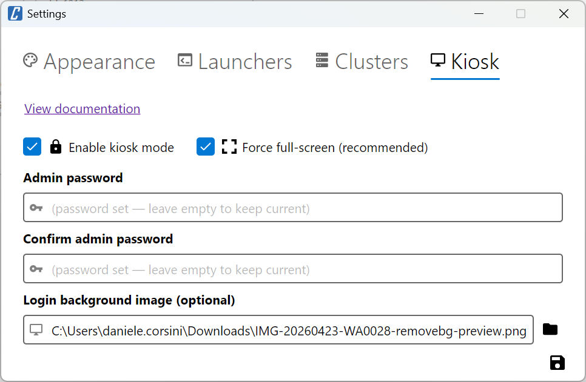

# Kiosk Mode

cv4pve-vdi includes a **kiosk mode** for thin-client and shared-workstation scenarios — for example a single PC used by multiple Proxmox users, where each user logs in with their own credentials and only sees the VMs they have permission for.

When kiosk mode is active, the application:

- Starts **full-screen** (both login and main window)
- Hides advanced settings from regular users (Launchers, Clusters, advanced Appearance options)
- Requires an **admin password** to access protected configuration or close the window
- Lets the user **switch user** without restarting the app — perfect for shared thin clients



## How it works

| Action | Regular user | Admin (after entering password) |
|--------|--------------|----------------------------------|
| Open the **Settings → Appearance** tab | ✅ Limited to **Theme** and **Default View** | ✅ Full options |
| Open the **Settings → Launchers** tab | ❌ Hidden | ✅ Visible |
| Open the **Settings → Clusters** tab | ❌ Hidden | ✅ Visible |
| Open the **Settings → Kiosk** tab | 🔒 Requires admin password | ✅ Visible |
| Configure services on a VM (**Connect → Configure services...**) | 🔒 Requires admin password | ✅ Allowed |
| Open Settings from the **login window** | 🔒 Requires admin password | ✅ Allowed |
| Close the application (X / Alt+F4) | 🔒 Requires admin password | ✅ Allowed |
| **Switch user** (More menu → Switch user) | ✅ Always allowed | ✅ Always allowed |
| Browse documentation / report bug / support links | ❌ Hidden | ✅ Visible |

Once an admin enters the correct password, the session stays unlocked until either:

- the application is closed, or
- the user clicks **Switch user** in the *More* menu

This means the admin can configure everything in one go without re-entering the password for each protected action.

## Setting up kiosk mode

1. Launch cv4pve-vdi normally and log into Proxmox.
2. Open **More → Settings**.
3. Go to the **Kiosk** tab.
4. Check **Enable kiosk mode**.
5. Set an **Admin password** (and confirm it). This password is required to access any protected configuration after the kiosk is locked.
6. *(Optional)* Pick a **Login background image** — it will fill the area around the login form when the window is full-screen. Useful for branding the thin client.
7. Click **Save**. The kiosk takes effect on the next launch.

> [!IMPORTANT]
> The admin password is stored as a **PBKDF2-SHA256 hash** in `config.yaml`. It is not recoverable. If forgotten, the only way out is editing the file manually (clear the `KioskAdminPasswordHash` field) and disabling kiosk mode from there.

## The login screen in kiosk mode

When kiosk mode is active, the login window opens **full-screen** instead of the regular compact dialog. The login form keeps its normal size and is centered in the screen, so the layout stays clean even on large monitors.

If a **Login background image** is configured, it fills the area around the centered form using `UniformToFill` scaling (the image fills the screen, maintaining aspect ratio, cropping the edges if needed). This is useful for branding the thin client with a company logo or wallpaper. Supported formats: PNG, JPG, BMP, GIF.

Closing the login window (window X button, `Alt+F4`) is blocked unless the admin password is provided, so the kiosk can't be exited accidentally — the user can only proceed by logging in or by an admin shutdown.

## Full-screen behavior

By default, kiosk mode forces both the login and main windows to open in **full-screen** (`WindowState = FullScreen`). The **Force full-screen (recommended)** checkbox in the Kiosk tab controls this behavior.

**Leave it on (recommended) when:**

- You want a self-contained thin-client experience: the user only sees cv4pve-vdi, no taskbar, no system tray, no way to peek at the desktop underneath
- The OS desktop is still running (cv4pve-vdi is just an auto-started application, not the shell)

**Turn it off when:**

- You're replacing the **OS shell** with cv4pve-vdi (Windows Assigned Access / Shell Launcher, Linux `.xinitrc` or session `Exec=`). In this scenario the window manager already manages the window — usually maximizing it to the only available screen area — so the application enforcing full-screen on top is redundant
- You use a tiling window manager (i3, sway, hyprland) that prefers to size windows itself
- You need the kiosk on a sub-region of the screen (e.g. a secondary monitor) and let an external tool handle placement

The application-side restrictions (hidden settings, admin password, switch user, blocked close) stay active regardless of this flag — only the full-screen forcing is toggled.

## Switching user

In kiosk mode, the **More → Switch user** menu item returns the application to the login screen without closing the process. This is the recommended flow when multiple people share the same thin client: each user logs in with their own Proxmox account, does their work, and clicks *Switch user* to leave the workstation ready for the next person.

Switching user also clears the sticky admin unlock — the next user (or admin) will need to enter the admin password again to access protected configuration.

## Deploying a thin client

The application-side lockdown (kiosk mode) protects the UI. For full thin-client isolation you also want to prevent the user from escaping cv4pve-vdi to the underlying OS. This is done at the **operating system** level, not by cv4pve-vdi.

### Windows (Assigned Access / Shell Launcher)

Windows 11 Pro/Enterprise can replace the default Explorer shell with a specific application:

1. Sign in as an administrator.
2. Open **Settings → Accounts → Other users → Set up a kiosk**.
3. Add a new local user (e.g. `vdi-user`) that will be auto-logged at boot.
4. Choose **cv4pve-vdi** as the kiosk application.
5. Reboot — Windows starts, auto-logs the kiosk user, launches cv4pve-vdi as the shell, and `Ctrl+Alt+Del` is the only way out (admin password required).

Alternatively, use [Shell Launcher v2](https://learn.microsoft.com/en-us/windows/configuration/shell-launcher/) for finer control via XML configuration.

> [!TIP]
> Make sure the kiosk Windows user has **read-only access** to `%APPDATA%\cv4pve-vdi\config.yaml`. This prevents the user from tampering with the kiosk flag, even if they manage to open a file manager.

### Linux (replace the desktop shell)

On Linux you can set cv4pve-vdi as the auto-started application of a stripped-down session:

- Create a `.desktop` file under `/usr/share/xsessions/cv4pve-vdi.desktop`:
  ```ini
  [Desktop Entry]
  Name=cv4pve-vdi Kiosk
  Exec=/path/to/cv4pve-vdi
  Type=Application
  ```
- Configure your display manager (gdm/lightdm/sddm) to auto-login a dedicated user with that session.
- Restrict the user's permissions and remove access to a terminal.

Protect the config file with strict permissions:

```bash
sudo chown root:vdi-user ~/.config/cv4pve-vdi/config.yaml
sudo chmod 640 ~/.config/cv4pve-vdi/config.yaml
```

The user can still read the file (cv4pve-vdi needs it) but cannot modify it.

## Configuration reference

The kiosk-related fields in `config.yaml`:

```yaml
kiosk: true
kioskAdminPasswordHash: "100000.IjpAjlpw...=.h3KkLm...="     # PBKDF2-SHA256 hash
kioskLoginBackground: "/path/to/background.png"               # optional
kioskForceFullScreen: true                                    # default true
```

| Field | Type | Description |
|-------|------|-------------|
| `kiosk` | bool | Enables kiosk mode. Default: `false`. |
| `kioskAdminPasswordHash` | string | PBKDF2-SHA256 hash (with salt) of the admin password. Format: `iterations.saltBase64.hashBase64`. |
| `kioskLoginBackground` | string | Path to an image file used as the login window background when kiosk mode is active. Supported: PNG, JPG, BMP, GIF. |
| `kioskForceFullScreen` | bool | Force the login and main windows to open in full-screen. Set to `false` if your shell replacement / window manager already handles sizing. Default: `true`. |

## Why no per-user profiles?

Some VDI products implement their own user database inside the client. cv4pve-vdi does not — and intentionally so:

- Proxmox already has users, groups and **ACLs**. After login, PVE filters which VMs the user can see and act on.
- Adding a second authentication layer inside cv4pve-vdi would duplicate (and likely contradict) the authoritative source.
- The kiosk pattern — locked client config + per-user Proxmox login — covers the shared-workstation scenario without any extra moving parts.

This is the same approach used by Citrix Workspace `InKioskMode`, VMware Horizon kiosk accounts, Remmina kiosk profiles and TigerVNC full-screen viewers.
