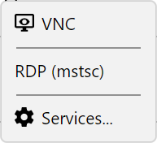
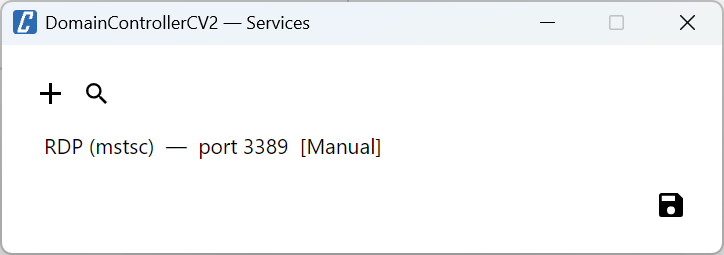
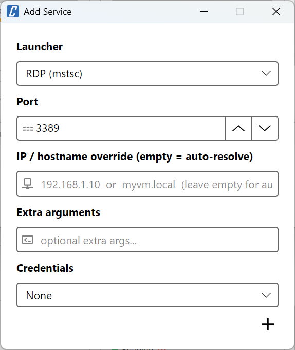
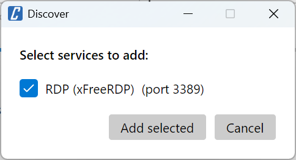

# VM Services

A **service** maps a [launcher](../README.md#service-launchers) to a specific VM and optionally overrides port, credentials, IP or extra arguments. Each VM can have multiple services configured — typically one for RDP and one for SSH — and they appear together in the **Connect** dropdown on the VM row.



## Managing services for a VM

To configure services for a VM, click **Connect → Services...** in the VM row. The services window lists every service already configured for that VM, with a toolbar to add, edit, delete or auto-discover them.



From here you can:

- **Add** a new service, selecting the launcher and port
- **Edit** an existing service (double-click on a row also works)
- **Delete** a service
- **Discover** — scan the VM's IP for open ports and automatically suggest matching services

Once services are configured, they appear as items in the **Connect** dropdown button on the VM row, alongside the built-in SPICE and VNC entries.

## Adding or editing a service

The edit dialog covers all the per-service knobs:



| Field | Description |
|-------|-------------|
| **Launcher** | Which built-in or custom launcher to invoke (e.g. *RDP (mstsc)*, *SSH (PuTTY)*) |
| **Port** | Defaults to the launcher's default port; override here if the VM listens on a non-standard port |
| **IP override** | Force a specific IP/hostname; leave empty to auto-resolve via QEMU guest agent |
| **Extra arguments** | Appended to the launcher's command line (replaces `{extraArgs}` in the template) |
| **Credential Source** | How credentials are provided to the launcher — see below |

### Credential sources

| Source | Description |
|--------|-------------|
| **None** | No credentials passed to the launcher |
| **Vdi** | Reuse the username and password used to log into Proxmox VE (no need to type them again) |
| **Manual** | Username/password stored per-service in the configuration |

> [!WARNING]
> Manual credentials (username and password) are stored **in plaintext** in the configuration file:
> - Linux/macOS: `~/.config/cv4pve-vdi/config.yaml`
> - Windows: `%APPDATA%\cv4pve-vdi\config.yaml`
>
> This is consistent with other desktop tools (kubectl, git credentials, SSH config). Restrict access to the file:
> ```bash
> chmod 600 ~/.config/cv4pve-vdi/config.yaml
> ```

> [!NOTE]
> On Windows, launchers can be configured to push the credentials into the **Windows Credential Manager** (Vault) just before launching the executable, and remove them shortly after. This is how the built-in **RDP (mstsc)** launcher achieves SSO — see [Single Sign-On for RDP](#single-sign-on-for-rdp-windows) below.

## Discovering services

If a VM is running and exposes the QEMU guest agent, you can let cv4pve-vdi probe its open ports and suggest matching services. Click **Discover** in the services window: cv4pve-vdi scans the VM's IP for the default port of every launcher available on the current platform, and shows the matches in a dialog.



Tick the services you want to add and click **Add selected**. Each one is created with the launcher's default port and `CredentialSource = None` — open the new entry afterwards if you need to set credentials or extra arguments.

> [!NOTE]
> Discovery requires the QEMU guest agent to be installed and enabled on the VM (Proxmox VE: VM Options → QEMU Guest Agent → Enabled). If the IP cannot be resolved, the discover button shows an error.

## Single Sign-On for RDP (Windows)

To launch an RDP session **without re-entering credentials**, configure the **RDP (mstsc)** service for the VM (**Connect → Services... → Add**) and pick a **Credential Source** based on your scenario:

| Credential Source | Behaviour | Best for |
|-------------------|-----------|----------|
| **None** | mstsc starts with no explicit credentials. Windows automatically forwards the credentials of the **currently logged-in OS user** to the RDP server (CredSSP). | The local Windows user and the target VM are joined to the **same Active Directory domain**. This is the classic Windows desktop SSO experience. |
| **Vdi** | The username and password used to log into cv4pve-vdi (i.e. the Proxmox login) are injected into the Windows Credential Vault as `TERMSRV/<ip>`, then mstsc reads them automatically. | The Proxmox account matches a valid Windows account on the VM (e.g. shared LDAP/AD between Proxmox and the VMs, same username and password). |
| **Manual** | Username and password stored per-service in the configuration are injected into the Vault the same way. | The VM uses different credentials than the Proxmox login (local accounts, workgroup, standalone VMs, or a different domain). |

For the **Vdi** and **Manual** options, the Vault entry is temporary: it is created right before launching `mstsc` and removed automatically a few seconds later.

> [!NOTE]
> If you log into Proxmox as `root@pam` but want to RDP into VMs as a different user (e.g. your AD account or a local Windows account), choose **None** or **Manual** — **Vdi** would inject `root` as the RDP username, which is rarely useful.
>
> The **Manual** option works in all scenarios (domain, workgroup, standalone VMs). For local Windows accounts use the username as-is (e.g. `Administrator`), or prefix with `.\` (e.g. `.\Administrator`) to force a local-account lookup.
